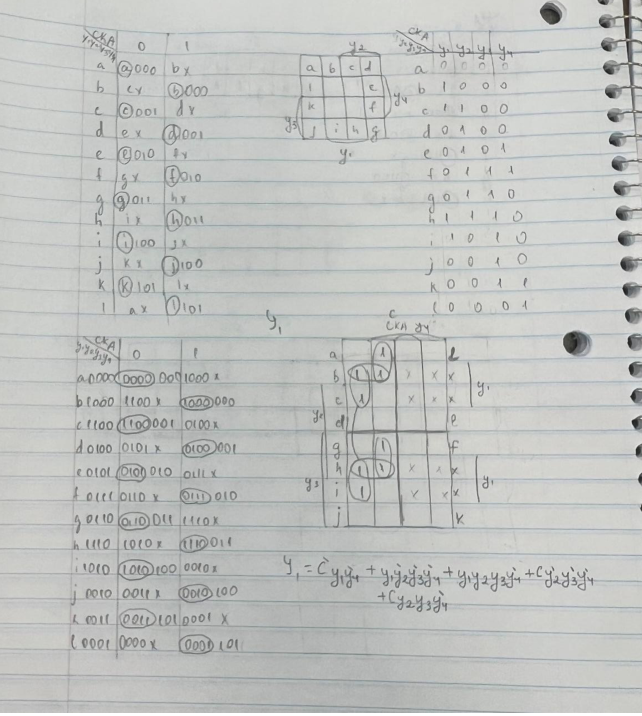
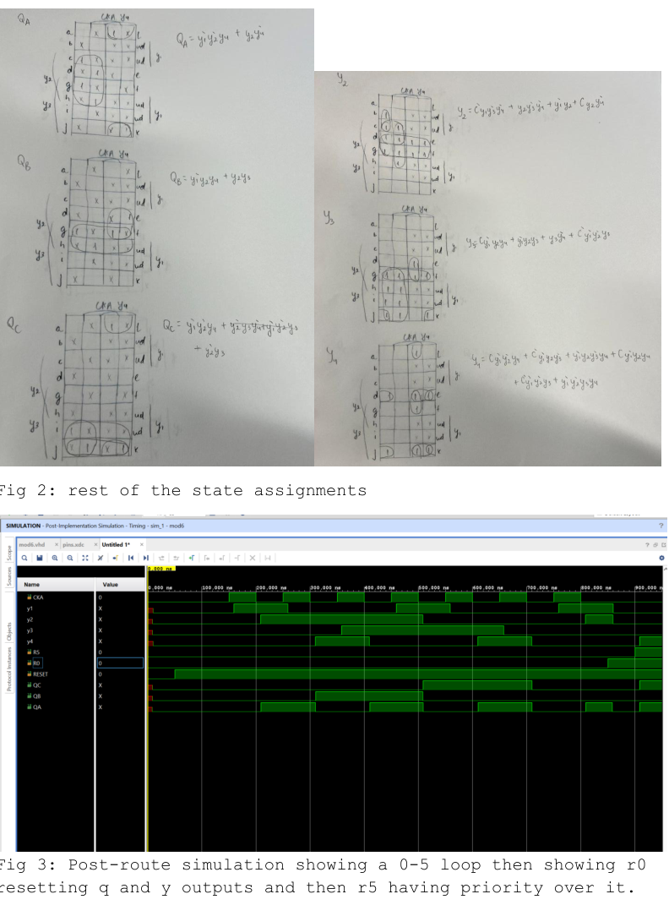
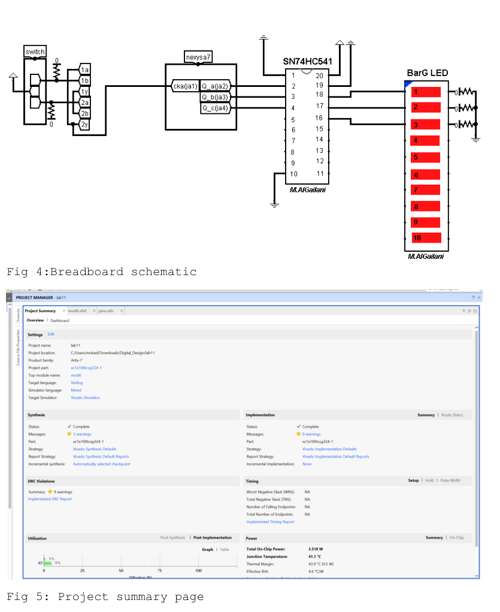
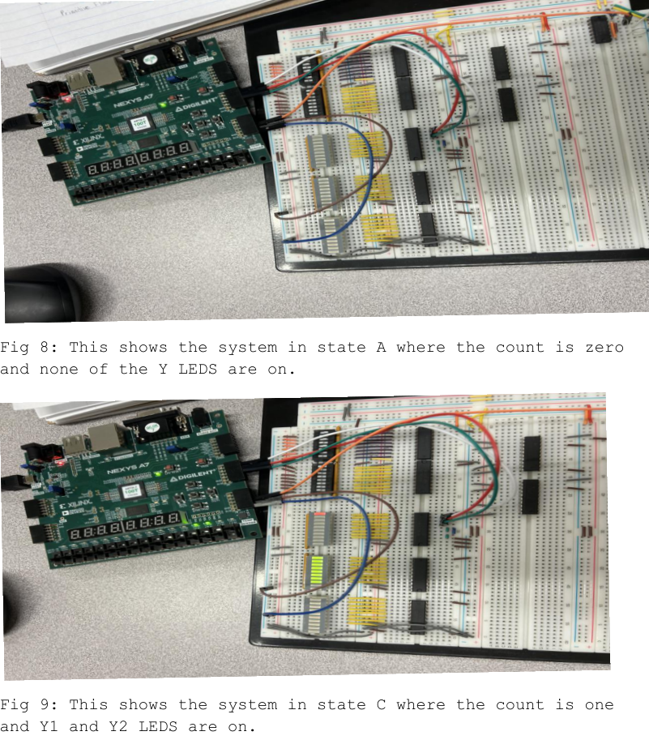
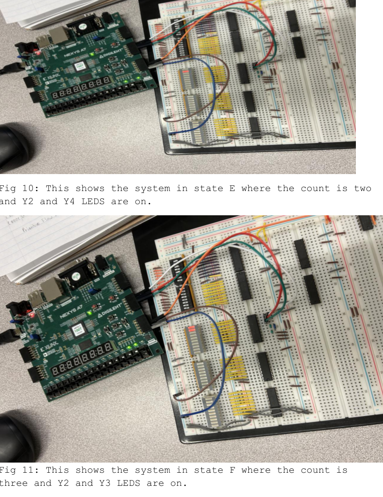
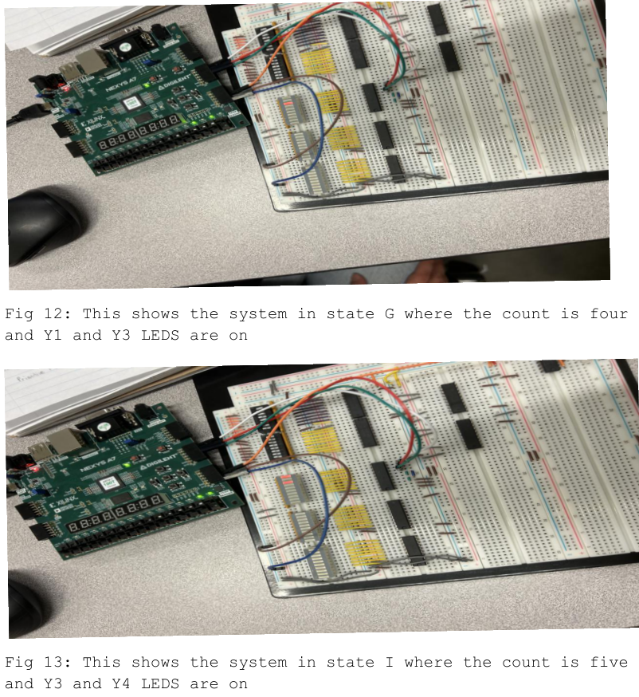
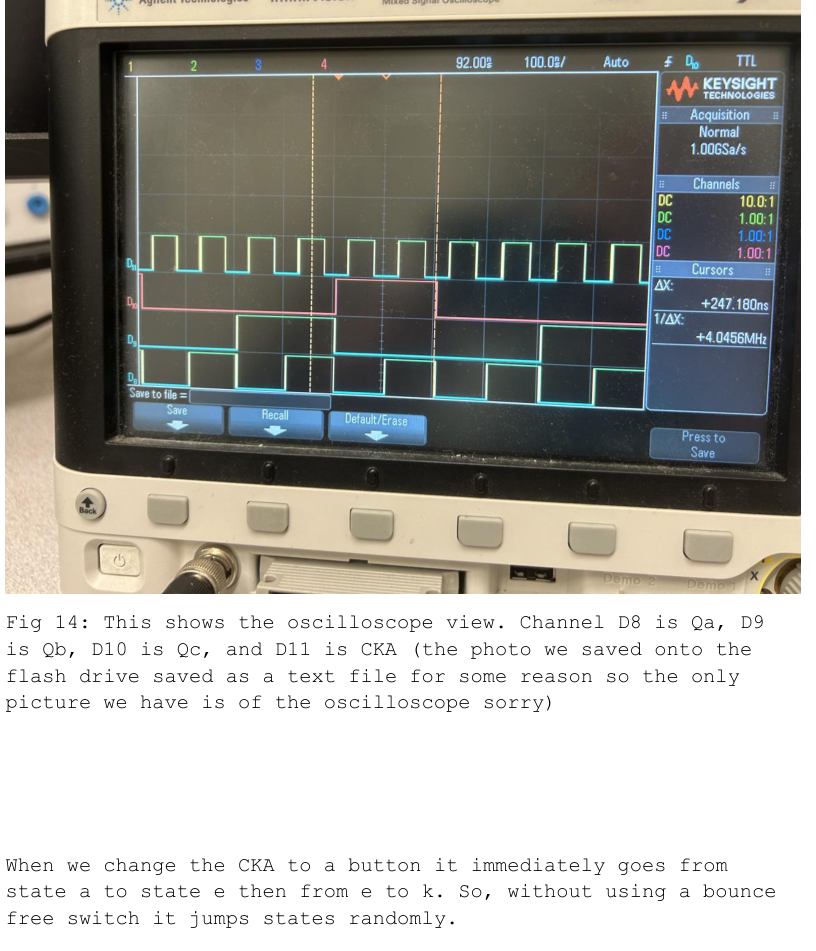

# Asynchronous Sequential Counter (Modified SN7490A)

This lab took the **SN7490A decade counter idea** and made it weirder (in a good way): we designed a **modified asynchronous counter** in VHDL, built a **critical race‑free state assignment**, derived the next‑state logic (K‑maps), and then proved it on hardware with a breadboard + Nexys A7.

Two takeaways:
- Asynchronous logic **will** bite you if your state assignment isn’t race‑free.
- A noisy clock button will make the circuit look haunted unless you use a **bounce‑free switch**.

---

## Repo description (GitHub description box)

Asynchronous sequential counter (modified SN7490A-style) in VHDL with critical race‑free state assignment and K‑map derived next‑state equations, verified in post-route simulation and validated on Nexys A7 hardware (including R0 reset and R5 priority behavior).

---

## What’s in this repo

- Critical race‑free assignment + assigned state table
- K‑maps / derived equations for state variables `y1..y4` and outputs `QA/QB/QC`
- Post‑route simulation showing the **0→5 loop**, plus **R0 reset** and **R5 priority**
- Breadboard schematic + implementation photos for multiple states
- Oscilloscope capture demonstrating why bounce-free clocks matter
- Appendix: VHDL + Tcl + XDC

---


---

## Race‑free assignment + state table



More K‑maps + the post-route sim screenshot:



---

## Breadboard schematic + implementation summary



---

## Hardware validation

### R5 vs R0 priority


### Example states

  
  


---

## Oscilloscope: why bounce-free clocks matter

When the input clock is a normal push button (no debounce), the report notes the system can jump states randomly (example: **a→e**, then **e→k** immediately).



---

## Code snippets (from the appendix)

### VHDL: priority reset + async logic

```vhdl
if r5 = '1' then  -- R5 has priority over R0
  y1 <= '0'; y2 <= '0'; y3 <= '0'; y4 <= '1';
  qa <= '1'; qb <= '0'; qc <= '1';
else
  if r0 = '1' then
    y1 <= '0'; y2 <= '0'; y3 <= '0'; y4 <= '0';
    qa <= '0'; qb <= '0'; qc <= '0';
  else
    y1 <= ( ... ) and reset;
    y2 <= ( ... ) and reset;
    y3 <= ( ... ) and reset;
    y4 <= ( ... ) and reset;

    QA <= ( ... ) and reset;
    QB <= ( ... ) and reset;
    QC <= ( ... ) and reset;
  end if;
end if;
```

### XDC: allow combinational feedback loops

```tcl
set_property ALLOW_COMBINATORIAL_LOOPS TRUE [get_nets y1*];
set_property ALLOW_COMBINATORIAL_LOOPS TRUE [get_nets y2*];
set_property ALLOW_COMBINATORIAL_LOOPS TRUE [get_nets y3*];
set_property ALLOW_COMBINATORIAL_LOOPS TRUE [get_nets y4*];
```

### Tcl: clock stepping + reset tests

```tcl
restart
add_force R0 {0 0ns}
add_force R5 {0 0ns}
add_force CKA {0 0ns}
add_force RESET {0 0ns}
run 50ns
add_force RESET {1 0ns}
run 50ns
# toggle CKA repeatedly to walk states...
add_force R0 {1 0ns}
run 50ns
add_force R5 {1 0ns}
run 50ns
```

---

## Run it (Vivado)

1. Create a Vivado project targeting **Nexys A7**.
2. Add `src/mod6.vhd` and `constraints/mod6.xdc`.
3. Run post-route simulation and `source sim/mod6_forces.tcl`.
4. Program the FPGA and verify:
   - the loop sequence through the intended states
   - `R0` clears outputs
   - `R5` overrides `R0`
5. If you’re clocking manually: use a **bounce‑free** switch/circuit.

---

## Report

See `report/ECE 4525 Lab 11.pdf` for the full write-up and appendix code.
